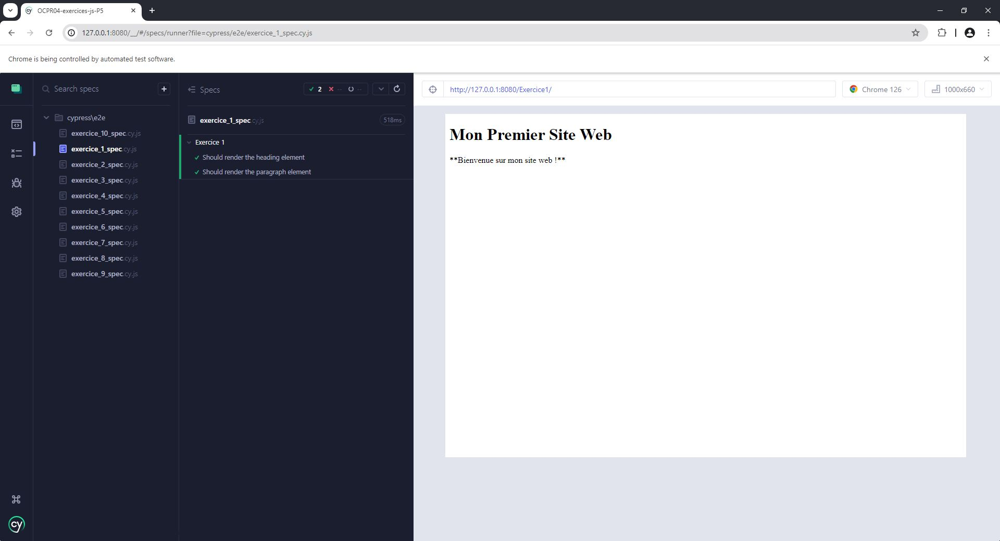
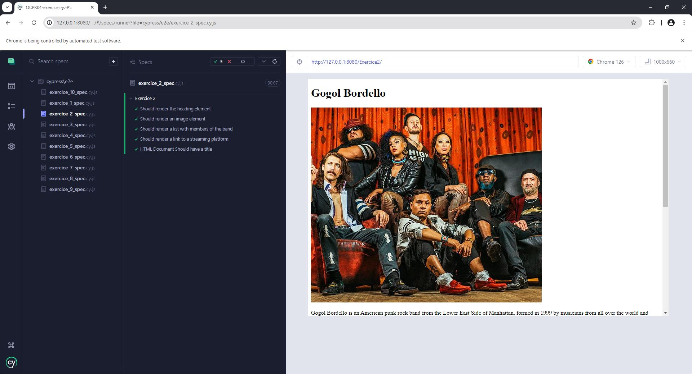
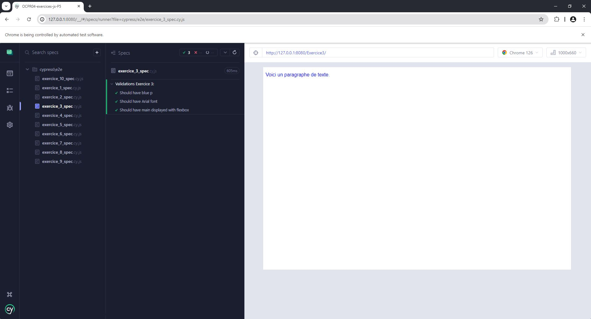
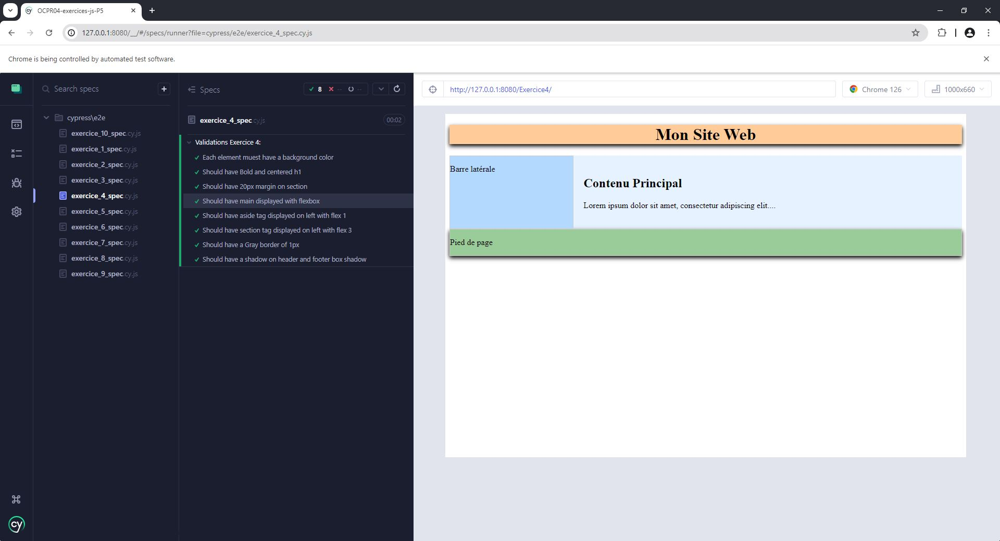
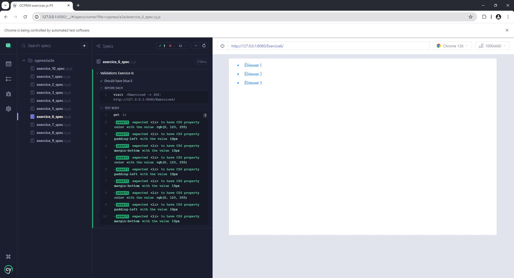
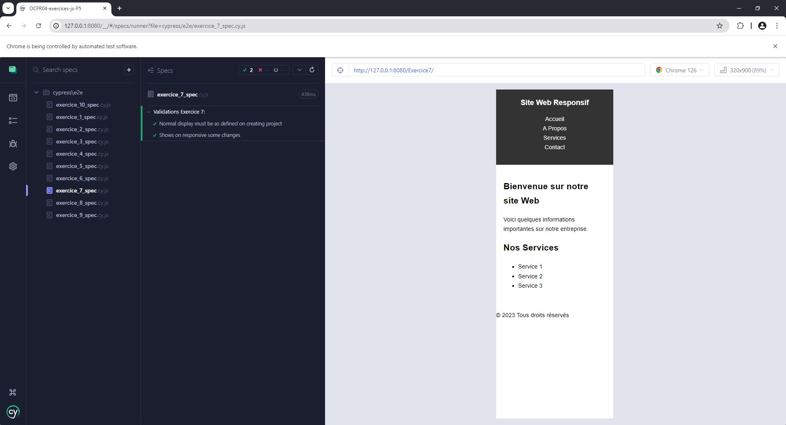
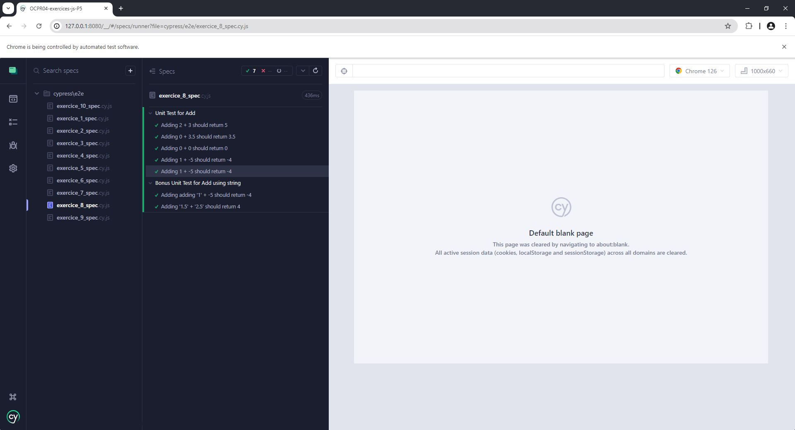
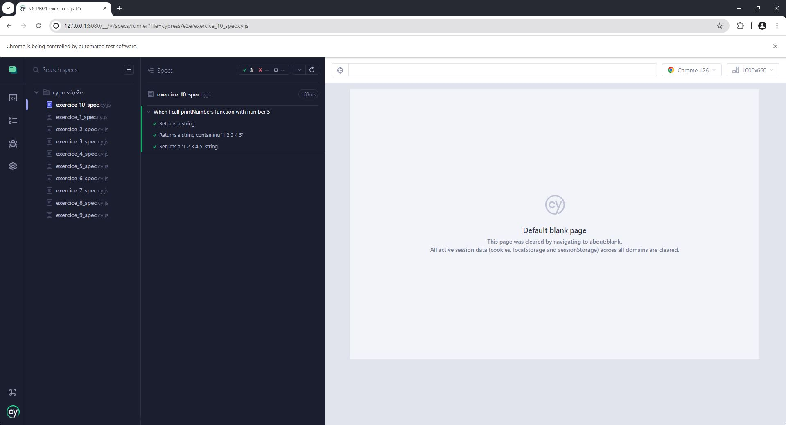

# OCPR4-exercices-js-P5

Testez vos compétences : les langages du Web

Pour commencer le projet, lancez la commande `npm install` qui installera les dépendances du projet.

Vous pourrez ainsi réaliser les différents exercices.

Pour vérifier que votre exercice est correctement réalisé vous n'avez qu'à lancer la commande `npm start` puis la commande `npm run test`.
Vous verrez alors s'afficher l'application `Cypress`.
Sélectionnez `E2E Testing` puis sélectionnez le navigateur dans lequel vous voulez lancer vos tests.

Si votre code est correct alors les tests seront décrits en vert.

Bon entraînement !

## Resultats des tests

### Exercice 1



### Exercice 2



### Exercice 3



### Exercice 4

Le test initial était erroné:

```
it('Should have a shadow on header and footer box shadow', () => {
cy.get('header').should('exist').and('have.css', 'box-shadow').and('not.contain.value', 'none')
cy.get('footer').should('exist').and('have.css', 'box-shadow').and('not.contain.value', 'none')
})
```

Le test a été corrigé et remplacé par:

```
it("Should have a shadow on header and footer box shadow", () => {
    cy.get("header")
      .should("exist")
      .and("have.css", "box-shadow")
      .should("not.equal", "none");
    cy.get("footer")
      .should("exist")
      .and("have.css", "box-shadow")
      .should("not.equal", "none");
  });
```



### Exercice 5


### Exercice 6

Le test initial était erroné:

```
it('Should have blue li', () => {
      cy.get('li').each($li => {
          expect($li).to.have.css('color', 'rgb(0, 0, 255)');
          expect($li).to.have.css('padding-left', '10px');
          expect($li).to.have.css('margin-bottom', '15px');
      })
  })
```

Le test a été corrigé et remplacé par:

```
it("Should have blue li", () => {
    cy.get("li").each(($li) => {
      expect($li).to.have.css("color", "rgb(0, 123, 255)");
      expect($li).to.have.css("padding-left", "10px");
      expect($li).to.have.css("margin-bottom", "15px");
    });
  });
```



### Exercice 7



### Exercice 8



### Exercice 9


### Exercice 10


